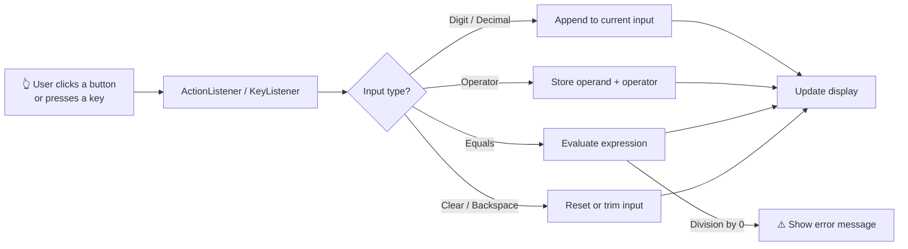

<!-- ===================== HEADER (animated wave) ===================== -->
<p align="center">
  
</p>

<!-- ===================== TYPING ANIMATION ===================== -->
<p align="center">
  <a href="https://git.io/typing-svg">
    
  </a>
</p>

<!-- ===================== BADGES ===================== -->
<p align="center">
  
  
  
  
  
</p>

<p align="center">
  
  
  
</p>

<p align="center">
  <a href="#-features">Features</a> •
  <a href="#-preview">Preview</a> •
  <a href="#-getting-started">Getting Started</a> •
  <a href="#-how-it-works">How It Works</a> •
  <a href="#-keyboard-shortcuts">Shortcuts</a> •
  <a href="#-project-structure">Structure</a> •
  <a href="#-roadmap">Roadmap</a> •
  <a href="#-contributing">Contributing</a>
</p>

---

## ✨ Overview

**Swing Calculator** is a lightweight desktop calculator written entirely in **Java** using the **Swing** GUI toolkit. No frameworks, no external libraries: just clean object-oriented code, a responsive layout, and a polished interface.

It's a great project for learning:

- 🧱 Building layouts with `GridLayout`, `BorderLayout`, and nested panels
- 🎯 Event handling with `ActionListener` and `KeyListener`
- 🎨 Custom styling of Swing components (fonts, colors, borders, hover effects)
- 🧠 Separating **UI** from **calculation logic** (MVC-style)

---

## 🔥 Features

| | Feature | Description |
|---|---|---|
| ➕ | **Basic arithmetic** | Addition, subtraction, multiplication, and division |
| 🔢 | **Decimal support** | Work with floating-point numbers; prevents duplicate decimal points |
| ⌫ | **Backspace & Clear** | Delete the last digit (`⌫`), clear the entry (`CE`), or reset everything (`C`) |
| ± | **Sign toggle** | Flip between positive and negative instantly |
| ％ | **Percentage** | Quick percent calculations |
| ⌨️ | **Full keyboard support** | Type numbers and operators straight from your keyboard |
| 🛡️ | **Error handling** | Divide-by-zero and invalid input are handled gracefully, no crashes |
| 🕘 | **Expression display** | See the running expression above the current result |
| 🎨 | **Modern look** | Dark theme, rounded-feel buttons, hover and press feedback |
| 📦 | **Zero dependencies** | Runs on any machine with a JDK installed |

---

## 🖼️ Preview

<p align="center">
  <!-- Replace with your own screenshot or GIF: put it in /assets and update the path -->
  
</p>

<details>
<summary><b>📸 More screenshots</b> (click to expand)</summary>

<p align="center">
  
  
</p>

</details>

> 💡 **Tip:** Record a quick GIF with [ScreenToGif](https://www.screentogif.com/) (Windows), [Kap](https://getkap.co/) (macOS) or [Peek](https://github.com/phw/peek) (Linux) and drop it into `assets/demo.gif`.

---

## 🚀 Getting Started

### 📋 Prerequisites

- **JDK 17 or newer** → check with `java -version`
- *(Optional)* **Maven 3.8+** if you prefer a build tool

### ⚡ Quick Run (no build tool)

```bash
# 1. Clone the repository
git clone https://github.com/YOUR_USERNAME/YOUR_REPO.git
cd YOUR_REPO

# 2. Compile
javac -d out src/*.java

# 3. Run
java -cp out Main
```

### 🧰 Using Maven

```bash
mvn clean package
java -jar target/swing-calculator-1.0.jar
```

### 🧠 Using an IDE

<details>
<summary><b>IntelliJ IDEA</b></summary>

1. `File` → `Open` → select the project folder
2. Set the **Project SDK** to JDK 17+
3. Right-click `Main.java` → **Run 'Main.main()'**

</details>

<details>
<summary><b>Eclipse</b></summary>

1. `File` → `Import` → `Existing Projects into Workspace`
2. Right-click `Main.java` → `Run As` → `Java Application`

</details>

<details>
<summary><b>VS Code</b></summary>

1. Install the **Extension Pack for Java**
2. Open the folder and click ▶️ **Run** above `main()`

</details>

### 📦 Build a Runnable JAR (manual)

```bash
javac -d out src/*.java
echo "Main-Class: Main" > manifest.txt
jar cfm Calculator.jar manifest.txt -C out .
java -jar Calculator.jar
```

---

## ⌨️ Keyboard Shortcuts

| Key | Action |
|:---:|--------|
| `0` – `9` | Enter digits |
| `.` | Decimal point |
| `+` `-` `*` `/` | Operators |
| `Enter` or `=` | Calculate result |
| `Backspace` | Delete last digit |
| `Esc` | Clear all (`C`) |
| `Delete` | Clear entry (`CE`) |

---

## 🧠 How It Works



**Core idea:** the UI layer only collects input and renders output. All math lives in a separate calculator engine, which keeps the code testable and easy to extend.

```java
// Simplified example of the evaluation logic
public double calculate(double a, double b, char op) {
    return switch (op) {
        case '+' -> a + b;
        case '-' -> a - b;
        case '*' -> a * b;
        case '/' -> {
            if (b == 0) throw new ArithmeticException("Cannot divide by zero");
            yield a / b;
        }
        default -> throw new IllegalArgumentException("Unknown operator: " + op);
    };
}
```

---

## 🗂️ Project Structure

```text
📦 YOUR_REPO
 ┣ 📂 src
 ┃ ┣ 📜 Main.java             # Entry point, launches the UI on the Event Dispatch Thread
 ┃ ┣ 📜 CalculatorUI.java     # JFrame, panels, buttons, and display
 ┃ ┣ 📜 CalculatorEngine.java # Pure calculation logic (no Swing imports)
 ┃ ┗ 📜 Theme.java            # Colors, fonts, and shared styling constants
 ┣ 📂 assets
 ┃ ┣ 🖼️ demo.gif
 ┃ ┗ 🖼️ screenshot-dark.png
 ┣ 📜 pom.xml                 # (optional) Maven config
 ┣ 📜 LICENSE
 ┗ 📜 README.md
```

> ✏️ Adjust file names to match your actual project.

---

## 🎨 Customization

Want your own look? Tweak the constants in `Theme.java`:

```java
public static final Color BACKGROUND   = new Color(0x1E1E2E);
public static final Color BUTTON       = new Color(0x313244);
public static final Color BUTTON_HOVER = new Color(0x45475A);
public static final Color ACCENT       = new Color(0xA855F7);
public static final Font  DISPLAY_FONT = new Font("Segoe UI", Font.BOLD, 36);
```

Swap the accent color, change the font, and you've got a brand-new calculator.

---

## 🧪 Testing

If you've added JUnit tests for the engine:

```bash
mvn test
```

Suggested test cases:

- ✅ `2 + 3 = 5`
- ✅ `10 / 4 = 2.5`
- ✅ `0.1 + 0.2` displays cleanly (rounding)
- ✅ `5 / 0` shows an error instead of crashing
- ✅ Chained operations: `2 + 3 * 4`

---

## 🛠️ Tech Stack

<p align="center">
  
</p>

---

## 🗺️ Roadmap

- [x] Basic arithmetic operations
- [x] Keyboard input
- [x] Divide-by-zero handling
- [ ] 🌗 Light / Dark theme toggle
- [ ] 🕘 Calculation history panel
- [ ] 🔬 Scientific mode (`sin`, `cos`, `tan`, `log`, `√`, `x²`)
- [ ] 💾 Memory functions (`M+`, `M-`, `MR`, `MC`)
- [ ] 📋 Copy result to clipboard
- [ ] 🌍 Localization

---

## 🤝 Contributing

Contributions, issues, and feature requests are welcome!

1. 🍴 **Fork** the project
2. 🌿 Create your branch: `git checkout -b feature/amazing-feature`
3. 💾 Commit your changes: `git commit -m "Add amazing feature"`
4. 📤 Push to the branch: `git push origin feature/amazing-feature`
5. 🔁 Open a **Pull Request**

---

## 📄 License

Distributed under the **MIT License**. See [`LICENSE`](LICENSE) for details.

---

## 👤 Author

<p align="center">
  <b>Your Name</b><br/>
  <a href="https://github.com/YOUR_USERNAME"></a>
  <a href="https://linkedin.com/in/YOUR_PROFILE"></a>
</p>

<p align="center">
  ⭐ <b>If you like this project, give it a star!</b> ⭐
</p>

<!-- ===================== FOOTER (animated wave) ===================== -->
<p align="center">
  
</p>
