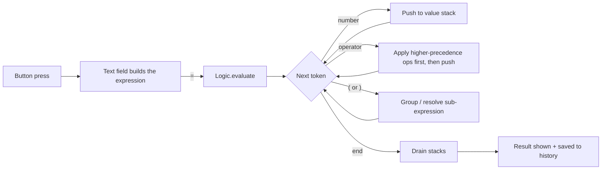

<div align="center">


<br/>

[](https://git.io/typing-svg)


</div>

---

## ✨ Features

| | Feature | Details |
|---|---|---|
| ➕ | **Core arithmetic** | Addition, subtraction, multiplication and division |
| 🧠 | **Operator precedence** | `2 + 3 * 4` correctly gives `14`, not `20` |
| 🔢 | **Decimal results** | All math is done in `double` |
| 🕘 | **History panel** | Every `expression = result` is saved and viewable from the `...` menu |
| 🧹 | **Clear controls** | `CLEAR` wipes the display; `Clear` in History wipes saved calculations |
| 🪶 | **Zero dependencies** | Pure Java and the standard `javax.swing` library |

---

## 🎬 How it works

The calculator evaluates expressions with a classic **two-stack algorithm** (the idea behind Dijkstra's shunting-yard): one stack for numbers, one for operators.



**Example trace** for `2 + 3 * 4`:

| Step | Token | Values | Operators |
|---|---|---|---|
| 1 | `2` | `[2]` | `[]` |
| 2 | `+` | `[2]` | `[+]` |
| 3 | `3` | `[2, 3]` | `[+]` |
| 4 | `*` | `[2, 3]` | `[+, *]` (`*` outranks `+`, so no reduce) |
| 5 | `4` | `[2, 3, 4]` | `[+, *]` |
| 6 | end | `[2, 12]` → `[14]` | `[]` |

---

## 🗂️ Project structure

```
Calculator/
├── assets/
│   └── banner.svg      # animated README banner
└── src/
    ├── Frame.java      # window, display, side menu and history panel
    ├── Buttons.java    # keypad layout and button listeners
    └── Logic.java      # expression parser / evaluator
```

| File | Responsibility |
|---|---|
| `Frame.java` | Builds the `JFrame`, display field, `...` menu, and the history panel |
| `Buttons.java` | Creates the keypad, appends input to the display, triggers evaluation on `=` |
| `Logic.java` | Tokenizes the string and evaluates it with two stacks |

---

## 🚀 Getting started

**Requirements:** JDK 8 or newer.

```bash
# 1. Clone the repo
git clone https://github.com/<your-username>/<your-repo>.git
cd <your-repo>

# 2. Compile (from the project root, since files use `package src;`)
javac src/*.java

# 3. Run (replace Main with the class that contains your main method)
java src.Main
```

---

## 🖱️ Usage

1. Tap digits and operators to build an expression in the display.
2. Press **`=`** to evaluate it.
3. Press **`CLEAR`** to reset the display.
4. Open the **`...`** menu → **History** to review past calculations.
5. In History, press **Clear** to erase them or **Close** to go back.

---

## 🛣️ Roadmap

- [x] `+`, `-`, `*`, `/` with correct precedence
- [x] Calculation history
- [x] Parentheses support in the evaluator
- [ ] Modulo (`%`) and power (`^`): buttons exist, evaluator support is coming
- [ ] Decimal point and parentheses buttons on the keypad
- [ ] Keyboard input
- [ ] Better error handling (e.g. malformed expressions, divide by zero)
- [ ] Dark / light theme toggle

---

## 🤝 Contributing

Ideas and pull requests are welcome.

1. Fork the project
2. Create your branch: `git checkout -b feature/amazing-idea`
3. Commit your changes: `git commit -m "Add amazing idea"`
4. Push and open a Pull Request

---

<div align="center">

Made with ☕ and Java

⭐ If you like this project, give it a star!

</div>
